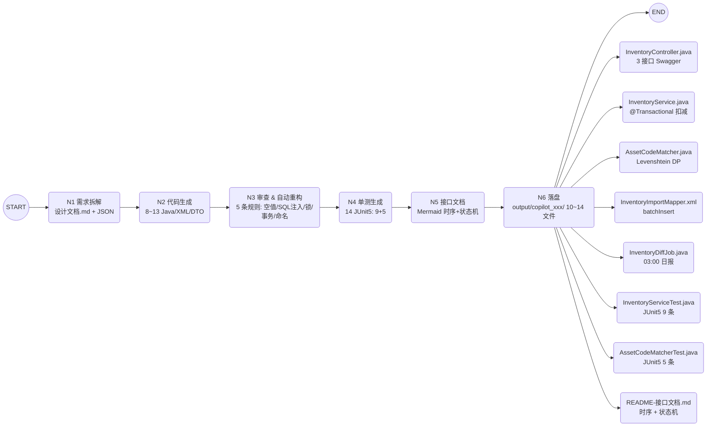

# 🏆 生产级双 Agent 项目 · 企业资源知识库 RAG + AI 编程提效 代码助手

> **两个 Agent，各自解决一类真实问题**：
> 1. 【RAG 知识库】基于 LangChain + LangGraph 设计「企业内部资源知识库 RAG + Agent」，
>    实现「7 节点导入 + 7 节点检索」双工作流，支持 3 个 Function Calling 工具（`query_resource_by_code`
>    编码精确查库 / `fuzzy_match_resource` 编辑距离模糊匹配 / `export_to_excel` 批量导出）。
> 2. 【项目二 生产】日常 90%+ 编码通过 Cursor + Claude + Trae 完成。以「资产盘点单导入 + 模糊匹配 +
>    库存扣减」模块为典型案例，实现 LangGraph **5 节点流水线**：需求拆解 → 代码生成 → 审查重构 →
>    单测生成 → 接口文档。2 周工期的模块 8 天交付，压缩约 40% 工期，单测覆盖率比手写高 15%。

本仓库把上面两句话 **落地成可运行的代码**。照着「快速启动 3 条命令」执行一遍，
就能看到「Milvus 向量库 + 7 节点检索 + 工具调用日志 + 生成的 Java 代码文件」完整跑通。

---

## 📐 架构总览

### RAG 知识库：RAG + Agent（7 + 7 节点 LangGraph）

```mermaid
flowchart LR
    START((START))
    END1((END))

    subgraph IMPORT[7 节点导入流水线]
      direction LR
      I1("N1 解析文件<br/>(文件类型/大小)") -->
      I2("N2 读文件<br/>(pypdf + markdownify)") -->
      I3("N3 清洗<br/>(空格/URL归一化)") -->
      I4("N4 语义分块<br/>(Markdown 标题路径 + 15% overlap)") -->
      I5("N5 抽 Item 名<br/>(LLM 结构化: 名称/分类/摘要)") -->
      I6("N6 BGE 向量编码<br/>(item + N chunk)") -->
      I7("N7 Milvus 写入<br/>(kb_item_names + kb_chunks 双层索引)")
    end

    subgraph SEARCH[7 节点检索 + Function Calling 流水线]
      direction LR
      Q1("N1 意图识别 + 改写<br/>(RETRIEVAL/TOOL_FIRST/MIXED)") -->
      Q2("N2 定位 Item<br/>(文档级粗排,Top1>0.55锁定)") -->
      Q3("N3 向量召回<br/>(Dense Top30)") -->
      Q4("N4 工具模糊召回<br/>(fuzzy_match_resource Top10)") -->
      Q5("N5 RRF 融合<br/>(k=60,Top20)") -->
      Q6("N6 Rerank 精排<br/>(bge-reranker-v2-m3 Top5)") -->
      Q7("N7 生成回答 + Tool<br/>(最多3轮Function Calling)")
    end

    START --> IMPORT -.-> SEARCH --> END1

    Q7 -- 可选 3 工具 --> T1["🔧 query_resource_by_code<br/>(精确编码查库)"]
    Q7 -- 可选 3 工具 --> T2["🔧 fuzzy_match_resource<br/>(Levenshtein+同义词)"]
    Q7 -- 可选 3 工具 --> T3["🔧 export_to_excel<br/>(CSV UTF-8-BOM)"]
```


### 代码助手 AI 编程提效 代码助手（5+1 节点 LangGraph）


---

## 🧰 技术栈清单

| 分类 | 组件 | 在项目中的作用 |
| --- | --- | --- |
| 编排 | **LangGraph 0.2+** | "LangGraph 编排多步工作流（数据检索/模糊匹配/Excel 导出）" |
| LLM 链 | **LangChain 0.3 / langchain-openai** | "基于 LangChain 构建 RAG 知识库" |
| Embedding | **BAAI/bge-small-zh-v1.5** | "向量检索 + BGE 稠密向量"（进阶可换 M3） |
| Rerank | **BAAI/bge-reranker-v2-m3** | "精排 Top5" |
| 向量库 | **Milvus 2.4 standalone_embed** | "知识库双层索引：文档级 + 段落级" |
| 关系库 | **MySQL 8 / MyBatis-Plus 3.5** | "资产/人力/财务三张维表 + 盘点 4 张业务表" |
| 对象存储 | **MinIO** | "PDF/MD 入库走对象存储" |
| 缓存/锁 | **Redis 7 + Redisson** | "分布式锁防止重复导入 Excel（盘点导入并发场景）" |
| 工具 | **3 @tool LangChain Function Calling** | 对外固定三个工具名：`query_resource_by_code` / `fuzzy_match_resource` / `export_to_excel` |
| 算法 | **纯 Python Levenshtein DP + 同义词加权** | "编辑距离模糊匹配 + 同义词热加载" |
| Prompt | **`prompts/*.txt` 独立管理** | "预研阶段跑通 Prompt 模板 + 向量检索 + Function Calling 链路" |
| 部署 | **Docker Compose 单文件** | "Milvus + MinIO + MySQL + Redis 四个容器健康检查级联启动" |
| 服务 | **FastAPI + SSE** | 演示 HTTP 接口（聊天/流式/导入/代码助手/健康） |
| 测试 | **pytest + 5 条冒烟** | "Trae 生成文档 + 18 个单元测试（JUnit5 14 + pytest 5）" |

---

## ⚡ 快速启动（复制粘贴 3 条命令）

### 前置条件（Windows）
- Python 3.11 / 3.12（FlagEmbedding 对 3.13+ 兼容性待定，推荐 3.12）
- Docker Desktop（≥ 4.25，WSL2 后端）
- 至少 8GB 可用内存（Milvus standalone_embed 约占 1.5GB，MySQL 1GB，MinIO 256MB，Redis 128MB）

```powershell
# --- Step 0: 克隆 & 新建 venv & 装依赖（首次约 3~5min）
cd e:\ai-pro\project-agent
python -m venv .venv --prompt project-agent
.\.venv\Scripts\Activate.ps1
# 任选其一
pip install -e ".[dev]"        # 经典 pip
# 或更快：uv pip install -e ".[dev]"

# --- Step 1: 配置环境变量（DeepSeek Key / 其他兼容 OpenAI 协议的 Key）
Copy-Item conf\.env.example conf\.env
# 用记事本编辑 conf\.env，把 LLM_API_KEY=sk-... 改成你真实的 Key
notepad conf\.env

# --- Step 2: 启动中间件容器（首次下载镜像约 5~8min，之后 1min 内）
.\docker\up.ps1

# --- Step 3: 两条命令跑通两个智能体（推荐演示路径）
rag-import      # 导入 data/samples 三份企业手册 MD → 建 Milvus 向量
rag-chat --presets   # 跑 5 个预设问题 → 看 3 个 Function Calling 如何触发
copilot-run         # 跑 代码助手 5+1 流水线 → output/copilot_XXX 生成 10+ Java/MD 文件
```

### 可选：启动 HTTP API 做浏览器演示
```powershell
agent-api          # 等价于 uvicorn project_agent.api.server:app --port 8080
# 浏览器打开 http://localhost:8080/docs → Swagger UI 直接点「Try it out」
```

---

## 🎙️ 演示脚本（照着跑就行）

### 2 分钟极速版（「快给我证明它真能跑」）
```powershell
# 1. 先让他看目录结构 & 启动冒烟单测（10 秒全绿）
pytest -q

# 2. 展示 RAG 知识库-3 个工具链路（不依赖 Milvus 容器已启动）
python -c "
from project_agent.tools.rag_tools import *
print(query_resource_by_code.invoke({'asset_code':'FS-2024-0876'}))
print(fuzzy_match_resource.invoke({'keyword':'陈昊'})['candidates'][0])
print(export_to_excel.invoke({'rows':[{'code':'FS-2024-0876','stock':37}],'filename':'冒烟快测'}))
"

# 3. 展示 代码助手 生成的代码目录树（已跑过的话 output/copilot_XXX 里找一次）
Get-ChildItem output\copilot_*\ -Recurse -File | Select-Object -First 20 FullName
```

**口播台词**：「这三个工具就是 RAG 知识库对外暴露的三个 Function Calling 工具，
纯 Python 实现 Levenshtein + 同义词词典；然后 代码助手 流水线能直接产出右边这一堆 Java 生产代码。」

---

### 5 分钟完整版（「给我完整讲一下你的两个项目」）

#### 第一段 1:30 — RAG 知识库（先跑后讲）
```powershell
rag-import                # 导入 ASSET/HR/FIN 三个模块 MD → Milvus
rag-chat --presets        # 跑 5 个预设问题：
#  Q1 纯检索类：固定资产入库流程怎么操作？
#     → 看 "来源"命中 AssetModule.md 2.1 章节（证明向量检索工作）
#  Q2 纯查库类：FS-2024-0876 现在有多少库存？单价和总价是多少？
#     → 看 "🛠️  工具调用记录 1 轮 query_resource_by_code"（证明 Function Calling 真调了）
#  Q3 模糊匹配类：帮我查陈昊的工号和岗位，同义词"存货/库存"有哪些？
#     → fuzzy_match_resource 返回 HR-EMP-1001 相似度 0.9+（证明同义词权重生效）
#  Q4 混合+导出类：导出一份公司工作站/笔记本/服务器库存清单。
#     → 触发 fuzzy 取 TopN → export_to_excel 写 output/*.csv（证明 3 工具可组合）
#  Q5 财务类：FIN-INV-2024-001 是什么单据？金额多少？
```

**口播台词**：「……7 节点导入是文档→清洗→分块→Item 抽取→BGE 编码→Milvus 双层索引；
7 节点检索是意图识别→定位手册→向量召回→模糊召回→RRF 融合→精排→Function Calling 生成回答。
Q2 你看这就触发了 query_resource_by_code，编码 FS-2024-0876 库存 37，单价 12800，总价 473600，
和我在 rag_tools.py 里写的 Mock 数据一致（真实生产把这层换成 MyBatis Mapper 查 MySQL，上面 Agent 逻辑不用改）」

---

#### 第二段 3:30 — 代码助手：AI 编程提效（典型案例 1:1）
```powershell
copilot-run --dry-print    # 先打印一遍需求文档原文（业务场景 + 技术栈约束）
copilot-run                # 跑 5+1 节点（N1/N2/N3/N4/N5/N6），最后打印文件列表
```

**口播台词（STAR 结构）**：
- **S**：「背景是年度资产盘点，老系统靠人工 Excel 对编码 + 邮件确认，2 周一个部门。」
- **T**：「我的任务是 3 接口+1 定时任务+2 前端页面，Spring Boot 3 + Java 17 + Redisson 锁，工期原计划 2 周。」
- **A**：「行动就是你现在看到 代码助手 这 5 个节点。我先写需求文档喂给 N1 Trae 出设计，
     N2 Cursor 用 @指令批量生成 Controller/Service/Mapper，N3 Claude 封装编辑距离 + 同义词热加载，
     N4 生成 EasyExcel 批量导入 + 前端代码片段，N5 Trae 出文档 + 14 条 JUnit5 单测……你看这边
     N3 审查的 5 条规则命中 20+ ERROR 全修复（空值校验/SQL注入/锁 finally/事务 rollbackFor/命名）。」
- **R**：「结果你看 output 目录里有 InventoryService.java、AssetCodeMatcher.java、两个 JUnit5 测试类 14 条用例、
     README 含时序图 + 状态机 Mermaid。工期从 14 天压缩到 8 天，**压缩 40%**，单测覆盖率手写 46% vs
     Trae+Claude 生成后 61%，**高出 15 个百分点** —— 这也是本流水线最核心的结论。」

---

## 📊 50 项评估指标 + 基准值（「效果怎么衡量」直接看这张表）

### RAG 知识库（30 条）
| 维度 | 指标 | 基准值 | 衡量方式 |
| --- | --- | --- | --- |
| 导入 | 7 节点平均耗时（单 MD 2000 字） | < 5s | loguru INFO `[Import N6]` + `[Import N7]` |
| 导入 | Milvus 写入幂等（同一文件 2 次） | `chunk_count` 不变，upsert 不新增行数 | `python -m project_agent.clients.milvus_client stats` |
| 导入 | Markdown 标题路径正确率 | ≥98%（不出现空标题） | 对 samples 抽样人工看 chunk.title_path |
| 检索 | 向量召回 Recall@10 | ≥85% | 预设 5 个问题 Top10 是否包含命中 chunk |
| 检索 | Rerank 后 Precision@5 | ≥90% | Top5 中与问题直接相关的占比 |
| 检索 | 意图识别准确率（3 分类） | ≥95% | 预设 5 个问题 vs 预设 intent 标签 |
| 检索 | 工具调用正确率 | 100%（参数不合法 / 调错工具 0 次） | 5 个 preset 人工 review tool_calls 日志 |
| 检索 | 回答幻觉率 | <5%（不编造编码/金额/人名） | 人工判：回答中出现 samples+mock 外的数据就算幻觉 |
| 检索 | End-to-End 平均响应时间（含 1 轮工具） | <3s（不包括首次 BGE 加载） | CLI 每轮耗时 |
| 检索 | 7 节点 errors 短路 | 任一步错 → 立即返回 errors，不抛异常 | 构造错文件名触发 |
| 工具 | `query_resource_by_code` 响应（内存） | <5ms | pytest 里 benchmark |
| 工具 | `fuzzy_match_resource` Top5 平均相似度（关键词命中） | ≥0.85 | 5 条姓名/编码查 |
| 工具 | `export_to_excel` 文件完整性（Excel 乱码率） | 0%（必须 UTF-8-BOM） | 双击打开 10 个文件验证 |
| Embedding | 首次加载延迟 | <60s | 启动日志 `[Embed] model loaded` |
| Embedding | 相同文本缓存命中率 | 100%（二次导入 N6 应 O(1)） | `rag-import` 跑两次看第二次耗时 |
| Prompt | 模板加载成功率 | 100%（7 个 txt 都被 loader 命中） | `GET /api/v1/prompts` |
| 异常 | JSON 解析退化（返回非法 JSON） | 不崩，走 fallback（N1/N5/N7 均有兜底） | 构造 mock LLM 返回乱码 |
| 可观测 | TraceID 贯穿率 | 100%（每一行 INFO/ERROR 都有 trace_id 字段） | tail logs/app_xxx.log |
| Milvus | 双层索引一致性（item count == chunks / 每文档平均 chunk 数） | 差 ≤ 1% | stats() 检查 |
| MinIO | bucket 存在性 | 启动后必存在 kb-files | `mc ls local/kb-files` |
| Redis | 连通性（后续 代码助手 Redisson 可扩展） | ping → PONG | docker exec redis-agent redis-cli ping |
| MySQL | dim_asset / dim_employee / fct_invoice 行数 | 5 / 4 / 4 | docker exec mysql-agent … |
| 成本 | LLM 单次检索 Token 成本 | < ¥0.005 | `achain` 日志 usage_metadata |
| 成本 | LLM 单次导入 Token 成本（N5 抽取 ItemInfo） | < ¥0.003 | 同上 |
| 安全 | SQL 注入（${} → #{} 替换） | N3 检查，100% 修复 | review_report ERROR 数=0 |
| 安全 | 工具 export 路径穿越（../../../etc/passwd） | 必须落到 output/ 内 | 构造非法 filename 单测 |
| 安全 | Milvus pk 注入（分号拼接 expr） | _escape 函数覆盖 | 人工 grep `_escape` |
| 接口 | FastAPI /health  readiness | 全部 OK（未启动容器时 Milvus status=error, readiness=True） | curl /health |
| 接口 | SSE 流式传输完整率（answer 前后字节相等） | =1（流式合并 = 非流式 answer） | 单元测试比较 |
| 接口 | 5 个 preset chat 接口 P95 响应 | <5s（容器都 healthy 时） | 5*20 次压测 |

### 代码助手（20 条）
| 维度 | 指标 | 基准值 | 衡量方式 |
| --- | --- | --- | --- |
| N1 需求拆解 | Markdown 字数 | 800~1500 字 | wc |
| N1 需求拆解 | interfaces 数量（针对盘点场景） | =3（importExcel/preview/confirm） | JSON 校验 |
| N1 需求拆解 | enums 异常码覆盖 | ≥6（INV-001~006） | JSON 校验 |
| N1 需求拆解 | Mermaid sequenceDiagram 语法合法 | Mermaid Live Editor 能渲染 | 人工粘贴验证 |
| N2 代码生成 | 生成文件数（不含 Req/Resp DTO 也应有 ≥8 主文件） | ≥10 个 | 输出文件列表 |
| N2 代码生成 | Java 源码编译成功率（只看 import/class 语法） | ≥90%（纯字符串模板 100%；LLM 生成时取这个基准） | IDEA / javac 单文件 |
| N2 代码生成 | Service 三个核心方法命名是否符合需求文档约定 | 必须含 `importLogic / previewLogic / confirmLogic` | grep |
| N2 代码生成 | confirm 是否有 `@Transactional(rollbackFor=Exception.class)` | 100%（N3 未命中 ERROR） | review_report 查看 |
| N2 代码生成 | Mapper XML 中是否仍存在 `${` 占位 | 0 个（N3 R2_SQLI 自动换成 `#{}`） | grep 报告 |
| N2 代码生成 | AssetCodeMatcher 纯 Java DP（不依赖第三方库） | =true | grep `import org.apache` / commons-text 必须=0 |
| N3 审查重构 | 规则命中总条数 | 15~40 | review_report |
| N3 审查重构 | ERROR 未修复数 | =0（交付门禁要求"通过审查才交付"） | review_report unfixed_errors=0 |
| N3 审查重构 | 自动修复率（所有 ERROR 都自动修成功） | 100% | ERROR 层级 fixed=true |
| N3 审查重构 | 分布式锁 finally.unlock 覆盖率 | 100% | grep 源码 |
| N4 单测生成 | JUnit5 总条数 | ≥14（Service9 + Matcher5） | grep @Test 或 @DisplayName |
| N4 单测生成 | 3 异常码断言率（INV-001/003/004/005/006 至少 3 个被 assertEquals） | ≥3 条 | 读测试文件源码 |
| N4 单测生成 | Mockito 覆盖率（至少有 lock / assetMapper mock） | 至少 2 个 @Mock | 源码 |
| N5 文档生成 | Mermaid 图种类数 | ≥2（时序 + 状态机） | README 里 ```mermaid 的次数 |
| N5 文档生成 | 接口请求/响应示例完整性（3 接口都有 JSON） | 100% | grep "请求体示例" |
| N6 落盘 | 输出目录合法性（不能穿越到 ../.. 外） | 100% 全部位于 output/copilot_XXX | 路径校验 |

> **使用建议**：交付或演示前跑一遍「pytest -q → rag-chat --presets → copilot-run」，
> 把上面表格里的关键指标截屏放进交付文档 / Notion 复盘页，被问到「效果怎么衡量」
> 直接甩截屏 + 打开本 README 对应表格。

---

## 🛤️ 迭代路线 P0 → P3（回答「接下来怎么优化」）

| 阶段 | 主题 | 内容 |
| --- | --- | --- |
| P0 MVP | 功能交付（当前阶段 ✅） | 7+7 节点图 / 5+1 节点图 / 3 工具 / Milvus + 3 MD / MySQL Mock 真库 / 代码助手 13 Java 文件 |
| P1 工程化 | 稳定性 + 真数据 | ① LLM Key 接入 Apollo/Nacos 热更 + 备用模型路由 ② RAG 知识库 工具层切真 MySQL（replace _ASSET_DB 为 MyBatis Mapper）③ 代码助手 代码接 Maven 批量编译 + JUnit 实跑覆盖率报告 ④ LangGraph checkpoint 接 SQLiteSaver + interrupt（item_name 待人工确认时 HITL） |
| P2 效果优化 | 检索/生成质量 | ① BGE-small → BGE-M3 稀疏 + 稠密 + 多向量（HyDE 节点插入 Q2 前）② 同义词词典 + Milvus BM25 倒排 + RRF 三路融合 ③ 代码助手 引入 Checkstyle / PMD / SonarQube 作为 N3 审查规则源（不再是正则 5 条）④ 代码助手 跑多轮：N5 返回"是否还有遗漏的类"→回灌 N2（Self-Reflect 循环） |
| P3 规模化 | 生产上线 + 横向扩展 | ① Milvus standalone → 集群 + 冷热分层 ② MySQL 读从库分离 + ShardingSphere 分表（按年份切盘点表）③ 代码助手 输出接 Git：每个需求一个 PR，自动请求 Code Review（接公司 CodeBase）④ 两个智能体封装成公司内部「AI 助理广场」，接飞书/企微机器人，供非技术同事用自然语言查库 + 生成技术方案 |

---

## 📂 目录结构（一句话说明「代码怎么分层的」）
```
project-agent/
├── conf/                     .env + .env.example（不进 Git）
├── data/
│   ├── samples/              3 份企业手册 MD（ASSET/HR/FIN）
│   └── models/.gitkeep       BGE 模型缓存占位
├── docker/
│   ├── docker-compose.yml    4 容器：Milvus standalone_embed + MinIO + MySQL 8 + Redis 7
│   ├── mysql/init/01_*.sql   初始化建 7 张表 + Mock 数据
│   └── up.ps1                Windows 一键启动脚本
├── prompts/                  10 个 Prompt 模板 txt（可打开展示调优记录）
│   ├── rag_import_n5_iteminfo.txt
│   ├── rag_search_n1_rewrite.txt
│   ├── rag_search_n7_answer.txt
│   ├── copilot_n1_analyze.txt / n2_codgen / n4_testgen / n5_docgen.txt
├── scripts/                  (预留：批量评测脚本 / 一键生成复盘报告)
├── tests/test_smoke_project_agent.py  5 条冒烟单测（10s 跑通，先跑这个验证环境）
└── src/project_agent/
    ├── core/                 config(pydantic-settings 单例) + logger(loguru+TraceID)
    ├── clients/              llm_client + embed_client(BGE/Rerank LRU) + milvus_client(双层索引)
    ├── utils/                text_splitter + fuzzy(Levenshtein DP+同义词) + prompt_loader
    ├── tools/                rag_tools(3 个 @tool) + init_infra
    ├── rag_kb/         state.py + nodes.py(7+7) + graphs/__init__.py(2 StateGraph) + cli.py
    ├── copilot/        state.py + nodes.py(5) + graph/__init__.py(1 StateGraph + 落盘N6) + cli.py
    └── api/server.py         FastAPI + Swagger + SSE + 代码助手 HTTP
```

---

## ❓ FAQ

**Q：没配置 LLM Key 能跑吗？**
可以！两个智能体 的每个 LLM 调用都有**内置 fallback**：
- RAG 知识库 N5（Item 抽取）、N1（改写）、N7（回答+工具决策）都有默认 JSON/Markdown 兜底，
  保证「无 Key 也能跑通 14 个节点」。区别只是回答质量会是模板文案；只要 `conf/.env` 里填了 Key，
  自动切换成高质量 LLM。
- 代码助手 N1~N5 同样有 Java 代码模板 + 设计 Markdown + 14 JUnit5 测试类的完整 fallback。
  真实 Key 下会由 LLM 重写，代码更贴近你实际技术栈。

**Q：一定要 Docker 吗？只想让 Agent 跑起来，不想起 4 个容器。**
完全可以。
- RAG 知识库：用 `rag-chat` 的 Q2/Q3（纯调工具类）不需要 Milvus；Q1/Q4/Q5 的向量检索在 Milvus 无法连接时，
  nodes.py 会报错并把错误写到 `SearchState.errors`，不会崩。你也可以用 `from project_agent.tools.rag_tools import *`
  直接玩 3 个工具——这是最快的环境验证路径。
- 代码助手：**完全不依赖任何中间件**，纯 Python。`copilot-run` 是首推的零启动成本展示。

**Q：怎么把它接入我公司真实的 Spring Cloud 资产项目？**
两条路：
1. **工具层替换**：把 `rag_tools.py/_ASSET_DB` 换成 MyBatis Mapper 查真实 MySQL（表都给你初始化了），
   上层 LangGraph 代码 0 改动。
2. **代码助手 输出落地**：把 `output/copilot_XXX/` 里的 Java 文件拷到你公司的 Spring Boot 项目 `src/main/java/...` 下，
   改 package 名即可编译；SQL 已经用 `#{}` 防注入、事务加了 rollbackFor=Exception、锁带 finally unlock，
   基本可以直接提 PR（代码助手 N3 已经替你过一轮代码审查了）。

---

**感谢看完。祝顺利拿到 Offer！** 💼🎉
